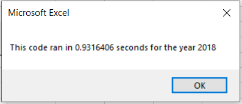
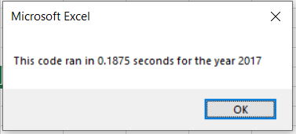
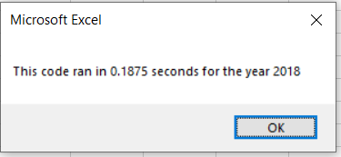

# stock-analysis

## Overview of Project
Overview of Project: Explain the purpose of this analysis.
The purpose of this project is to analyze different green energy stocks by comparing total daily volume (total number of shares traded throughout the day) and yearly return (percentage difference in price from the beginning of the year to the end of the year) in 2017 and 2018.

The purpose of this analysis is to 

analyze green energy stocks 
DAQO New Energy Corp (DQ) a company that make silicone wafers for solar panels

Steve is concerned about diversifying their funds

Steve realizes he will need to enable macros if he wants to run the analysis on new data in the future.

let's start analyzing some stock data. Steve wants to find the total daily volume and yearly return for each stock. Daily volume is the total number of shares traded throughout the day; it measures how actively a stock is traded. The yearly return is the percentage difference in price from the beginning of the year to the end of the year. Steve's parents are starting to pester him about Daqo's stock, so we'll start with DQ

Steve's parents want to know how actively DQ was traded in 2018. They believe that if a stock is traded often, then the price will accurately reflect the value of the stock. If we sum up all of the daily volume for DQ, we'll have the yearly volume and a rough idea of how often it gets traded.

## Results
The analysis was made using available data for twelve green energy stocks traded in 2017 and 2018. I summed up the daily volume for each one of the stocks to get the total daily volume per year. In order to get the yearly return, I summed up the starting price (the stock price on the first day of the year) and the ending price (the stock price on the last day of the year) for each stock and got the yearly return by dividing the ending price by the starting price and subtracting 1 to get the percentage of variation between these prices. Having this information, we can easily compare the yearly performance of each green energy stock.

The elapsed run time for the first version of this code (green_stocks.xlsm) was XXXX when running it for 2017 and XXXX for 2018.

After refactoring the code, the elapsed run time is now XXX for the year of 2017 and XXXX for 2018.

Results: Using images and examples of your code, compare the stock performance between 2017 and 2018, 

as well as the execution times of the original script and the refactored script.

## Summary
Summary: In a summary statement, address the following questions.
What are the advantages or disadvantages of refactoring code?
How do these pros and cons apply to refactoring the original VBA script?
